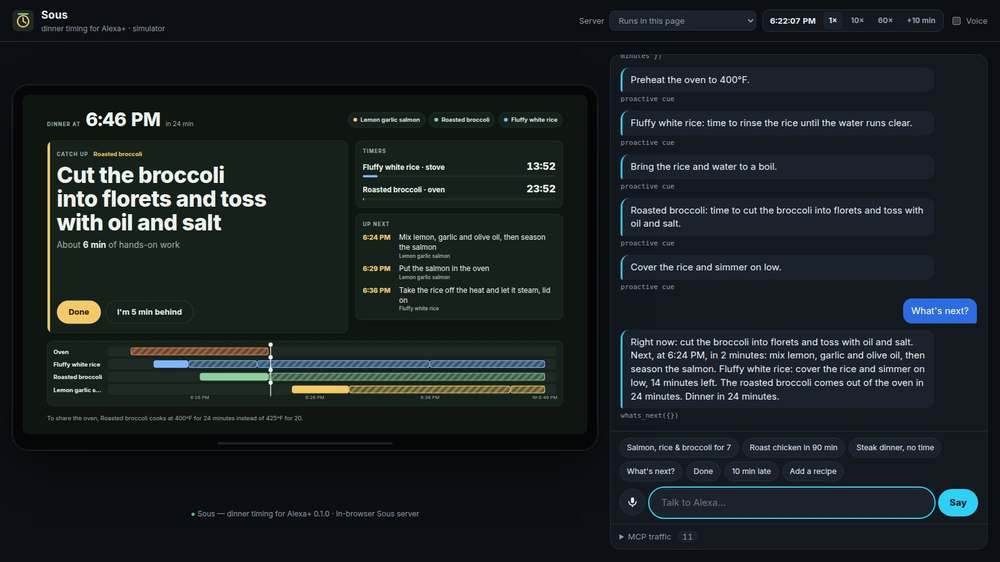
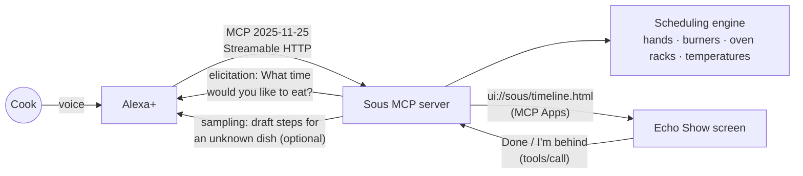

# Sous — every dish ready at the same time

**Sous is an Alexa+ agent skill for the hardest part of cooking dinner: timing.** Tell Alexa what you're making and when you want to eat. Sous works out when to start every step so the salmon, the rice and the broccoli all land on the table together, even with one pair of hands, four burners and a single oven. Then it walks you through the evening, speaks up when it's time for the next step, and re-plans on the spot when you fall behind.

> "Alexa, I'm making salmon, rice and broccoli. Dinner in 40 minutes."
>
> "Dinner is at 7:00. Start now: preheat the oven to 400°F. It's about 14 minutes of hands-on work. To share the oven, the broccoli roasts at 400°F for 24 minutes instead of 425°F for 20."

- **Try it in your browser:** https://stefansavic7.github.io/sous/ (simulated Alexa+, real MCP server running in the page)
- **Hackathon track:** Alexa+ (self-hosted MCP server over Streamable HTTP, MCP spec 2025-11-25) · Open Source mini challenge
- **License:** MIT



## Why

Alexa can already set five timers. What it can't do is *run dinner*: know that the rice needs 34 minutes but only 3 of them hands-on, that the salmon and the broccoli want different oven temperatures, that you can't sear a steak while you're mashing potatoes, and that when you're ten minutes behind, the fix is to start the broccoli now, not to push everything back. Home cooks do this juggling in their heads, and it's the reason multi-dish meals feel stressful. Sous turns it into a plan Alexa can follow with you.

## What it does

- **Plans a whole meal backwards from serve time.** Dishes that can't wait (fish, pasta) finish last; dishes that hold well (rice, soup, dessert) are scheduled earlier.
- **Respects a real kitchen:** one active task per cook, a limited number of burners, oven rack space, and oven temperature. Close temperatures are merged ("roast the broccoli at 400°F for 24 minutes so it can share the oven") while baking keeps its exact temperature. Preheating and temperature changes are inserted automatically.
- **Cooks along with you.** "What's next?" gives the current step, the next one and running timers. On a smart display, Alexa speaks each cue on time ("Put the salmon in the oven").
- **Adapts.** "I'm running 10 minutes late" reshuffles everything that hasn't started, keeps anything already in the oven fixed, and keeps the dinner time when it's still possible.
- **Learns family recipes** from pasted or dictated text: steps, durations, oven temperatures and which steps need hands.
- **Shows the plan on Echo Show** as an MCP App: a big "right now" card, timers, what's next, and a timeline of every dish.

## How it works



| Piece | What it is |
| --- | --- |
| [`packages/engine`](packages/engine) | Dependency-free TypeScript scheduler, recipe parser and cookbook. Also published on its own as the open-source contribution (see below). |
| [`server/src/sous.ts`](server/src/sous.ts) | The MCP server: tools, resources, prompts, elicitation and sampling. |
| [`server/src/http.ts`](server/src/http.ts) | Stateful Streamable HTTP endpoint (`/mcp`), optional bearer-token auth. |
| [`ui/`](ui) | The Echo Show view, built with MCP Apps and bundled into one HTML resource. |
| [`simulator/`](simulator) | Alexa+ simulator: a smart-display host for the view, voice in/out, proactive cues, and a live MCP traffic log. |

### The scheduling engine

Every recipe step has a duration, whether it needs hands (**active**) or just time (**passive**), and what it occupies (oven at a temperature, a burner, or nothing). The planner:

1. Orders dishes by how long they can wait once done, so the least forgiving dish gets the slot closest to serving.
2. Places each dish backwards from the serve time, step by step, at the latest minute where the cook's hands, a burner, or an oven rack at a compatible temperature is free. Prep steps may happen earlier; cooking steps stay back to back.
3. If two oven dishes are within 30°C (54°F), it tries cooking one at the other's temperature, adjusting the time about 1% per degree. Baking is never adjusted.
4. Inserts preheat and temperature-change steps, then reports anything a cook should know (a dish that will wait longer than it holds well, a very hands-on menu).

Re-planning pins what's already cooking, treats steps that should have started more than *N* minutes ago as done, and reschedules the rest from now, moving dinner only if it has to.

### MCP features used

| Feature | Where |
| --- | --- |
| Streamable HTTP, protocol `2025-11-25`, stateful sessions | `server/src/http.ts` |
| Tools with `outputSchema` + `structuredContent`, annotations and icons | all tools in `server/src/sous.ts` |
| MCP Apps (`_meta.ui.resourceUri`, `text/html;profile=mcp-app`) | `plan_dinner`, `whats_next`, `mark_step_done`, `running_late` → `ui://sous/timeline.html` |
| View-initiated tool calls | "Done" and "I'm behind" buttons on the screen |
| Elicitation (form) | asks for the dinner time when it wasn't given |
| Sampling | drafts steps for a dish Sous doesn't know, if the host allows it |
| Resource templates and resources | `sous://recipes/{id}`, `sous://plans/current` |
| Prompts | `plan_dinner_party` |
| Server `instructions` | tells the host model when to call which tool |

### Tools

| Tool | Say something like |
| --- | --- |
| `plan_dinner` | "I'm making steak, mashed potatoes and green beans for 7:30." |
| `whats_next` | "What's next?" · "How long on the salmon?" |
| `mark_step_done` | "The rice is rinsed." · "Done." |
| `running_late` | "I'm running 10 minutes late." · "Push dinner back 15 minutes." |
| `find_recipes` / `get_recipe` | "Find a recipe with potatoes." · "How do I make ćevapi?" |
| `add_recipe` | "Add a recipe: Grandma's stuffed peppers…" |
| `set_kitchen` | "I have two ovens." · "My partner is helping." |

## Run it

Requires Node.js 22.18 or newer.

```bash
npm install
npm run build        # Echo Show view, simulator and server bundle
npm start            # http://127.0.0.1:3001/mcp  and the simulator at http://127.0.0.1:3001/
npm test             # engine + end-to-end MCP tests
```

Configuration (environment variables):

| Variable | Default | Meaning |
| --- | --- | --- |
| `PORT`, `HOST` | `3001`, `127.0.0.1` | Where to listen. Use `HOST=0.0.0.0` behind a reverse proxy. |
| `SOUS_TOKEN` | unset | If set, `/mcp` requires `Authorization: Bearer <token>`. |
| `SOUS_TZ` | system time zone | Household time zone, e.g. `America/Chicago`. |
| `SOUS_UNITS` | `F` in the Americas, else `C` | Temperature units. |
| `SOUS_DATA` | `./data/sous.json` | Where plans and family recipes are saved. `memory` keeps nothing. |

Docker:

```bash
docker build -t sous .
docker run -p 3001:3001 -e HOST=0.0.0.0 -e SOUS_TOKEN=change-me -v sous-data:/app/data sous
```

### Connect an MCP client

- **Alexa+:** register the public HTTPS URL of `/mcp` as a self-hosted MCP server (Streamable HTTP). Put it behind TLS and set `SOUS_TOKEN`.
- **MCP Inspector:** `npx @modelcontextprotocol/inspector` → Streamable HTTP → `http://127.0.0.1:3001/mcp`.
- **Claude Desktop and other stdio clients:**

  ```json
  { "mcpServers": { "sous": { "command": "node", "args": ["/path/to/sous/server/dist/main.js", "--stdio"] } } }
  ```

### The simulator

Alexa+ isn't available everywhere yet (including where this was built), so [`simulator/`](simulator) is a stand-in host: a smart display that renders the MCP App the way an Echo Show would, speaks responses, listens through the browser's speech recognition, and announces cues on time. A small rule-based router maps utterances to tool calls in place of Alexa+'s language model. By default the real Sous server runs inside the page over an in-memory MCP transport; switch to "Self-hosted" to talk to your own server over Streamable HTTP. A demo clock (1×, 10×, 60×, +10 min) lets you cook a whole dinner in a minute.

## Open Source mini challenge

The scheduling engine is released separately as **[sous-engine](https://github.com/stefansavic7/sous-engine)** (MIT): a dependency-free library for planning multi-dish meals around a real kitchen, with a recipe-text parser and tests. Anyone building a cooking assistant, smart-oven app or meal-kit product can reuse it.

## Credits

Built by Stefan Savić for the *Build, Ship, Shape: Amazon Developer Hackathon* (2026), with Claude (Anthropic) as the AI coding agent. Recipes in the built-in cookbook are simple home-style versions written for this project.

MIT License. See [LICENSE](LICENSE).
